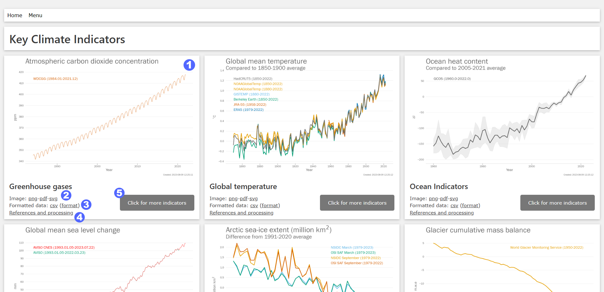

.. _userguide:

User guide
============

This is a user guide for those accessing the dashboards generated by this software.
The data are intended to be accessed via the dashboards, which also provides
images in standard formats, metadata about where the data came from and what
processing was applied.

Basic navigation
================

The basic aim of the dashboards is to share data used in the State of the Global Climate
report, as well as regional datasets derived from the same sources. The dashboard provides
images, text and data that can be used as the basis for writing monitoring reports.

   Screenshot indicating the important elements of the dashboard

The dashboard is split up into individual cards. Each card has the
following elements which are numbered in the image above:

1. A main image with an appropriate title
2. Links to the main image in different formats: png, svg and pdf. The
   last two of these are vector formats, so suitable for publication and editing.
3. A link to a zip file containing the datasets shown in the image. Clicking on the link
   will download the zip file. There is also a link to a webppage describing
   the data format. Each file in the zip archive is a csv file,
   and can be opened in Excel.
4. A link to "references and processing". The link takes you further down
   the page to a description of the indicator and other important information,
   including a link to the original data source, the correct citation, and details
   of the processing applied to each data set.
5. On the main dashboard there is button marked "Click for more indicators". Clicking
   the button takes you to a set of related indicators.

Below the main set of images, there are three sections

1. Introduction - explaining the contents of the page
2. Key messages - a set of short texts for some or all of the key indicators, automatically
   generated from the data.
3. Dataset and processing details - details of what data sets were used and the
   processing applied.

More detail on some of these elements is given below. The final element on the
page indicates when the page was created and what version of the software was
used to do so.

Image formats
=============

The main images are available in three formats:

1. png - Portable Network Graphics format. The images are relatively high resolution
   (1370 x 900 pixels) so should work well in most situations. The downside is that
   the file sizes are relatively large.
2. svg - Scalable Vector Graphics format. This is a vector format, so the images can be
   scaled and zoomed without loss of quality. As such, they are ideal for use in publications.
3. pdf - Portabl Document Format. This is a vector format, so the images can be scaled
   and zoomed without loss of quality. As such, they are ideal for use in publications.

Data format
===========

The data for each indicator are stored in zip files. These can be opened in windows by
right clicking and selecting "Extract all". When extracted, you get a directory containing
one or more csv files (Comma Separated Value). Csv files can be read by most data handling
programs, including Excel. The csv files conform to the BADC CSV standard
(https://help.ceda.ac.uk/article/105-badc-csv). Each csv file contains a header with
metadata followed by the data itself.

The metadata includes:

- the convention (BADC-CSV version 1) that is used to structure the file
- title
- the date of the last revision
- the date of validity (set to be the same as that of the last revision)
- feature type, which describes what the data represents
- creator, set in the code to be WMO
- source, gives the name and version of the software used to generate the file
- observation_station, set to "derived data"
- location, gives the latitude and longitude bounds of the data
- activity, provides a name for the activity that generated the data
- history, details the processing steps that have been applied to the data
- reference, a citation for the dataset
- rights, not filled
- comments, additional comments on the data

Then for each variable in the file, there are a number of components, which
specify what they represent

- long_name, a description of the variable and its units
- type, whether data are an integer (int) or floating point number (float)

One of the variables is marked as a "coordinate variable"

The data themselves appear after the word "data" in the left-most column.
There is one data column for each variable described by a long_name and type.
Data continue until the "end data" marker in the left-most column.

References and processing
=========================

The section on "references and processing" for each indicator includes the
following:

- a short description of the indicator
- a link to the data file (which is as described above)
- a checksum for the data file
- a link to the data format
- a list of data sets used in the indicator including the following information:
   - a link to the original data file if it is available online
   - a citation for the original data file either to a journal article, a data citation, or both
   - a list of the processing steps applied to the original data file to produce
     the indicator.

